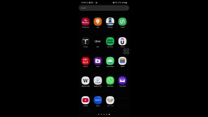
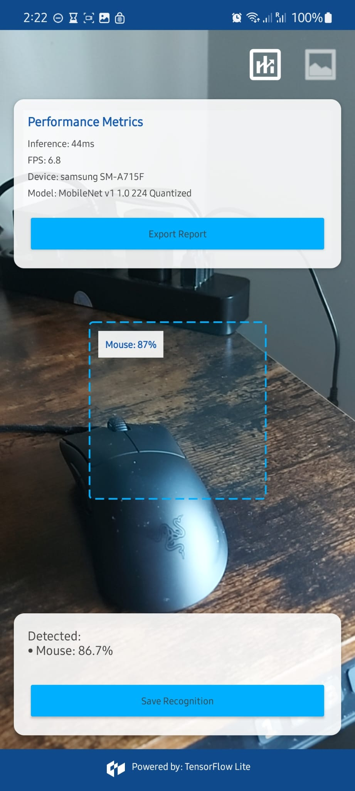
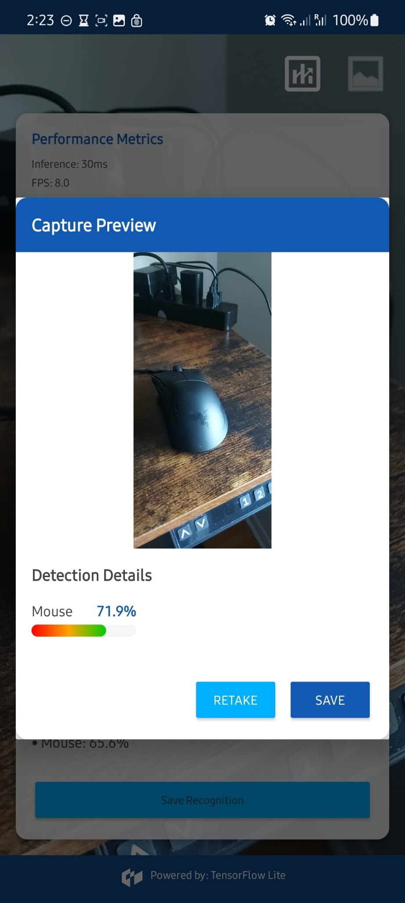
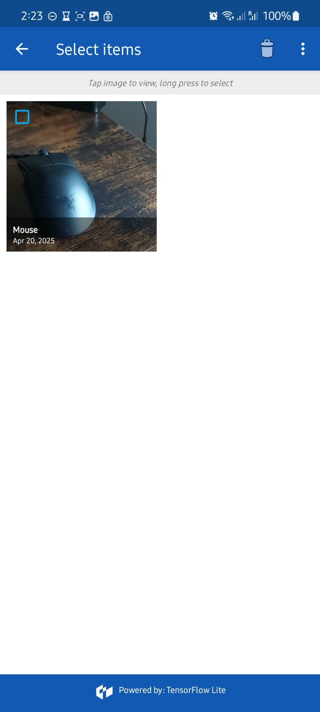
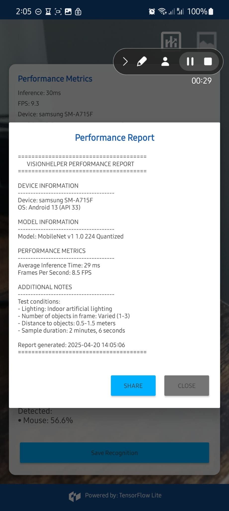

# VisionHelper

VisionHelper is an Android application that uses TensorFlow Lite to identify objects in real-time through your device's camera. The app allows users to save the recognized objects along with their detection details and provides a custom gallery for reviewing past detections.

## Demo



*VisionHelper app detecting objects in real-time*

## Screenshots

Take a look at the app in action:

<p align="center">
  
  
  
  
</p>

*From left to right: Main Camera View with real-time detection, Capture Preview with confidence bar, Gallery of saved detections, Performance metrics dashboard.*

## Features

- **Real-time Object Detection**: Identify multiple objects in your environment using your device's camera
- **Visual Feedback**: Clear bounding box shows the area being analyzed
- **Detection Details**: View confidence levels for each recognized object
- **Image Capture**: Save images with detection metadata for later reference
- **Preview Before Saving**: Review detection results before saving images
- **Custom Gallery**: Browse, view, and manage all your saved detections
- **Delete Functionality**: Remove unwanted images from the gallery
- **User-Friendly Navigation**: Easy-to-use interface with intuitive controls
- **Performance Metrics**: Real-time monitoring of inference latency and FPS

## Performance Metrics

VisionHelper includes an in-app performance dashboard that displays:

- **Inference Latency**: Time in milliseconds to process each frame
- **Frames Per Second (FPS)**: Number of frames processed per second
- **Device Information**: Current device manufacturer and model
- **Model Details**: AI model being used for object detection

The performance metrics can be toggled on/off using the metrics button in the top-right corner, making it easy to benchmark performance across different devices and conditions.

## Technologies Used

- Kotlin
- Android Jetpack components
- CameraX
- TensorFlow Lite
- MobileNet pre-trained model
- Material Design components

## Requirements

- Android Studio Arctic Fox or newer
- Android SDK 24+
- Android device with camera (or emulator with virtual camera)
- Android 7.0 (Nougat) or higher

## Installation

1. Clone this repository:
   ```
   git clone https://github.com/yourusername/visionhelper.git
   ```

2. Open the project in Android Studio.

3. Connect your Android device or start an emulator.

4. Build and run the app using Android Studio's "Run" button.

## Quick Install

### Try it yourself!
Scan this QR code to download the signed APK and install on your Android device:


**Note:** You must allow "Install unknown apps" for your browser or file manager (Settings → Apps → Special app access → Install unknown apps).

## Usage

### Object Detection

1. Launch the app and grant camera permissions when prompted.
2. Point your camera at objects you want to identify.
3. The app will display detection results in real-time, showing the object name and confidence level.
4. The green detection box helps you focus on the area being analyzed.

### Saving Images

1. When you've captured something you want to save, tap the "Save Recognition" button.
2. A preview dialog will appear showing the image and detection details.
3. Choose to either save the image or retake.
4. Saved images are stored in your gallery with detection information embedded in the filename.

### Using the Gallery

1. Tap the gallery icon in the top right corner to view your saved detections.
2. Browse through your saved images, which display the detected object and capture date.
3. Tap any image to view it in full screen.
4. To delete an image, tap the red delete button in the top-right corner of the image.
5. Use the "Return to camera" button at the bottom to go back to the camera view.

### Performance Monitoring

1. Tap the metrics icon in the top right corner to view real-time performance data.
2. The dashboard displays inference time, FPS, device information, and model details.
3. Use this data to benchmark performance across different devices and configurations.

## Technical Deep Dive

### ML Pipeline

VisionHelper uses a quantized MobileNet v1 model for efficient on-device inference:

1. **Frame Acquisition**: CameraX API captures frames from the device camera
2. **Pre-processing**: Each frame is resized to 224x224 pixels (the MobileNet input size)
3. **Inference**: The TensorFlow Lite interpreter processes the frame
4. **Post-processing**: Top predictions are extracted and displayed with confidence scores
5. **Performance Tracking**: Each inference is timed and aggregated to calculate metrics

### Threading Model

The app uses a multi-threaded approach for smooth performance:

- **Main Thread**: Handles UI updates and user interactions
- **Camera Thread**: Managed by CameraX for frame capture
- **Analysis Thread**: Processes frames and runs the TensorFlow model
- **Coroutines**: Used for background operations like saving images

## Project Structure

- **MainActivity**: Handles camera functionality and real-time object detection
- **ObjectDetectionViewModel**: Manages TensorFlow Lite model and detection processing
- **CapturePreviewDialog**: Displays image preview with detection details before saving
- **GalleryActivity**: Custom gallery implementation for browsing saved detections

## Roadmap

Future enhancements planned for VisionHelper:

### Model Improvements
- [ ] Support for quantized and float variants with automatic selection based on device capabilities
- [ ] Integration of Samsung-specific NPUs and acceleration libraries
- [ ] Fine-tuned models for specific domains (household objects, retail products)
- [ ] Advanced vision tasks like segmentation and pose estimation

### Samsung Ecosystem Integration
- [ ] One UI design language adoption for Samsung-native look and feel
- [ ] Bixby integration for voice-controlled object detection
- [ ] SmartThings connectivity for IoT device interaction
- [ ] Galaxy Watch companion for remote viewing and control

### UX Enhancements
- [ ] AR overlays using ARCore for interactive detection visualization
- [ ] Dark mode support with automatic theme switching
- [ ] Multi-language support for global markets
- [ ] Accessibility features for vision-impaired users

### Technical Enhancements
- [ ] Edge AI model management with on-device learning capabilities
- [ ] Multi-model pipeline for combined object detection and recognition
- [ ] Cloud synchronization for detection history
- [ ] Comprehensive testing suite and CI/CD pipeline

## License

This project is licensed under the MIT License - see the [LICENSE](LICENSE) file for details.

## Acknowledgments

- TensorFlow team for the MobileNet model
- Android developers at Google for CameraX and other libraries
- The open-source community for various libraries and tools used in this project

## Contributing

Contributions are welcome! Please feel free to submit a Pull Request.

1. Fork the repository
2. Create your feature branch (`git checkout -b feature/amazing-feature`)
3. Commit your changes (`git commit -m 'Add some amazing feature'`)
4. Push to the branch (`git push origin feature/amazing-feature`)
5. Open a Pull Request

## Support

If you encounter any issues or have questions, please file an issue on the GitHub repository. 